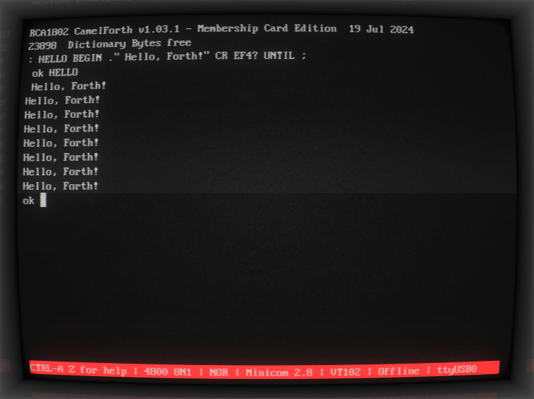

# CamelForth for the Membership Card

This is a port of [CamelForth](http://www.camelforth.com) for use with Lee Hart's 1802 Membership card, found here: https://www.sunrise-ev.com/1802.htm

## Changes from Vanilla CamelForth
### Additions:

 - New words: `inp` and `outp` for reading and writing directly to the
 1802's I/O ports
 - New words: `ef1?` `ef2?` `ef3?` `ef4?` query the status of the 1802's EF* lines
 - New word: `genbaud` sets the baudrate register depending on the next received byte, in the same way as MCSMP20 does. uses code derived from [The serial binary loader](https://www.retrotechnology.com/memship/mship_binloader.html)

### Removals:

 - `KEY?` is not implemented, as it's not possible to query the bit-banging code to detect pending serial transfers.
 - `TRACE` has been removed, as it serves no function on real hardware

### Changes: 

 - `ACCEPT` has been reverted to its reference implementation, and some minor enhancements have been made for modern terminals.
 - `COLD` is no longer invoked at start, instead a hidden word is invoked to generate the baudrate and to detect a warm start. to FORCE a cold start and delete all newly defined words, you can use the `COLD` word or hold down the IN button on your membership card while detecting the baud rate
 - `BYE` now jumps to 0x8B5E, the reentry point of MCSMP20
 - `KEY` and `EMIT` are both implemented using Q-as-TX and EF3-as-RX bit-banging, using code derived from [The serial binary loader](https://www.retrotechnology.com/memship/mship_binloader.html)

##  Examples

Example programs can be found in the `forth` directory.

## Building

### All platforms:

You will require the A18 cross-assembler, aquired from [here](http://www.retrotechnology.com/memship/a18.html)

You can configure the build environment by editing `src/camel.asm`

### Linux:

Building on Linux requires `make`, assuming the `a18` binary is in your `$PATH`, run `make` to generate all the I8HEX files

### Windows:

On Windows, assuming the `a18.exe` binary is in your `%PATH%`, run build.cmd to generate all the I8HEX files

## Running CamelForth on your Membership Card

To load CamelForth, you will require your Membership Card to have a monitor (or higher-level loader) that supports Intel HEX records.
Build the code, then using minicom, teraterm, or your terminal of choice, send `camel.hex` to the Membership card.

See [here](doc/minicom-example.md) for an example uploading using minicom on linux

## Known Issues

- `ascii-xfr` transfers from `minicom` do not play well with the reference `ACCEPT` routine, you'll have to key in your programs by hand. sorry.
- There is **ABSOLUTELY NO BOUNDS CHECKING** on the stacks, it's up to you to not clobber memory!
- The program has only been tested on a REV. L CPU board with a REV. L Front panel. `SEQ` and `REQ` logic as well as `B3` and `BN3` logic in the `KEY` and `EMIT` routines may be reversed for other revisions!
- There is no way to reenter the Forth interpreter after exiting with `BYE`, leaving programs potentially clobbered by the monitor
- The interpreter takes up around 100-200 bytes more than it should, thanks to page-alignment issues.
- `ACCEPT`, `WORD`, and `FIND` are implemented in high-level Forth, making the interpreter slower than it really should be when compiling words, sometimes taking up to several seconds to compile for larger words.
- Warm-start doesn't properly detect differing versions, so may leave the `LATEST` pointer pointing to the wrong place

## Troubleshooting
### No words are recognized after I loaded a new version!
This is a known issue with the warm-start routine, hold IN while hitting return during baudrate detection to force a cold-start

### Backspace does nothing!
your terminal might be sending a different code for backspace than CamelForth expects. Configure your terminal to send the correct code for the terminal type selected in `camel.asm` (`BS` for ANSI, `DEL` for VT)

## TODO

 - [X] ~~Port to the modern A18 assembler, PseudoSam is ancient, doesn't support macros, and has a few bugs of its own.~~
 - [X] ~~Update `GENBAUD`, `EMIT`, and `KEY` to use a USER variable rather than requiring a whole register~~
 - [X] ~~Implement a way to build for use in ROM~~
 - [ ] Implement a SAVE and LOAD routine
 - [ ] Save the structures/registers needed by MCSMP20 so that invocation doesn't clobber the Forth stack

